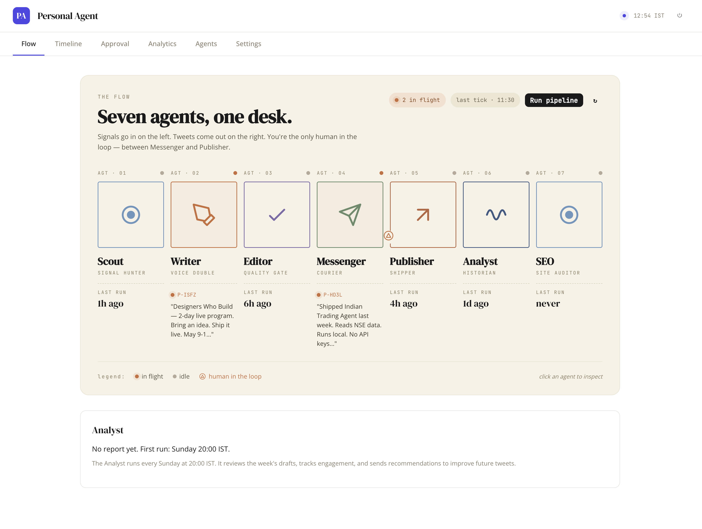

# Personal Brand Agent

Your AI brand team, on your terms.

Scout reads the web. Writer drafts in your voice. Editor grades. Messenger
sends drafts to your Telegram. You tap **Approve**. Publisher posts to Twitter
+ LinkedIn. Analyst writes a weekly report. SEO audits your site and proposes
commit-ready HTML fixes.

All BYOK — your own Claude, Twitter, LinkedIn, Telegram, and GitHub keys.
Your content never leaves your Supabase project.



---

## What it does

**7 AI agents chained into a content pipeline:**

| # | Agent | Runs | What it does |
|---|---|---|---|
| 1 | Scout | Every 6h | Fetches fresh signals from Hacker News / Reddit / Dev.to (no auth), filtered by your uber goal keywords |
| 2 | Writer | Daily 06:00 | Drafts 3 posts per run in your voice — one Twitter version + one LinkedIn version per draft, each with a branded image card |
| 3 | Editor | After Writer | Grades drafts on voice match, specificity, factual grounding, hook |
| 4 | Messenger | After Editor | Sends approved-grade drafts to your Telegram with inline buttons |
| 5 | Publisher | Every 15 min | Cross-posts approved drafts to Twitter + LinkedIn with the same branded PNG; chains threads; long-form LinkedIn |
| 6 | Analyst | Sundays 20:00 | Weekly report on what worked, what didn't, voice drift, missed topics |
| 7 | SEO | Mondays 09:30 | Audits your website, sends commit-ready HTML fixes to Telegram; tap ✓ Apply to auto-commit to GitHub |

---

## Architecture

- **Frontend** — vanilla HTML + [Alpine.js](https://alpinejs.dev) (CDN, no build step)
- **Backend** — Vercel Functions (Node.js 22)
- **Database** — Supabase (Postgres + RLS + Realtime + Auth)
- **AI** — [`@anthropic-ai/sdk`](https://github.com/anthropics/anthropic-sdk-typescript) with your own Claude key
- **Image gen** — server-side SVG → PNG via [`@resvg/resvg-js`](https://github.com/yisibl/resvg-js), with 6 bundled fonts (~6MB)
- **Twitter** — OAuth 2.0 PKCE, your own X developer app
- **LinkedIn** — OAuth 2.0 authorization-code, your own LinkedIn developer app
- **Telegram** — Raw Bot API; webhook auto-registers when you save your token
- **Scheduling** — Vercel Cron (Pro required for crons; free works otherwise)
- **Encryption** — AES-256-GCM for API keys at rest

---

## Setup — 10 minutes

### 1. Clone + deploy

```bash
git clone https://github.com/YOURUSERNAME/personal-brand-agent.git
cd personal-brand-agent
```

Create a Vercel project from this repo. Then create a Supabase project (free
tier is fine to start).

### 2. Run the schema

Open Supabase → SQL Editor → paste the contents of `db/supabase.sql` → Run.
One file. That's the entire DB — all tables, indexes, RLS policies,
realtime subscriptions, updated-at triggers. Safe to re-run.

The 7 default agents (Scout, Writer, Editor, etc.) seed themselves
automatically when you first sign in — you don't need to run any
separate seed script.

### 3. Set environment variables

In Vercel project settings, add these from `.env.example`:

```
SUPABASE_URL
SUPABASE_ANON_KEY
SUPABASE_SERVICE_ROLE_KEY
PA_ENCRYPTION_KEY          # 32-byte hex. Generate: openssl rand -hex 32
PA_ALLOWED_EMAILS          # comma-separated, or "*" for open signup
PA_APP_URL                 # e.g. https://yourdomain.com (no trailing slash)
```

Redeploy.

### 4. Sign in

Open `https://yourdomain.com/auth`, enter your email, click the magic link.
You'll land on the dashboard.

### 5. Pick a starter persona

First visit: Settings → Brand identity → click **✨ Apply a starter persona**.
Six options — designer-founder, tech-founder, indie hacker, writer/journalist,
engineering manager, or blank.

This pre-fills your brand voice, uber goal, reference links, and design
defaults with scaffolding. You edit from there with your actual details
(company names, project URLs, real numbers).

### 6. Connect your keys

Settings → API keys & connections. For each service:

- **Claude** — [console.anthropic.com](https://console.anthropic.com) → API key → paste
- **Twitter/X** — [developer.x.com](https://developer.x.com) → create a Web App → enable scopes `tweet.read tweet.write users.read media.write offline.access` → add callback `https://yourdomain.com/api/oauth/twitter-callback` → paste Client ID + Secret → authorize
- **LinkedIn** — [developer.linkedin.com/apps](https://developer.linkedin.com/apps) → create an app → request products *"Share on LinkedIn"* + *"Sign In with LinkedIn using OpenID Connect"* → add callback `https://yourdomain.com/api/oauth/linkedin-callback` → paste Client ID + Secret → authorize
- **Telegram** — message [@BotFather](https://t.me/BotFather) → `/newbot` → copy token. Then `/start` your bot. Visit `https://api.telegram.org/bot<TOKEN>/getUpdates` → copy `chat.id`. Paste both into Settings. Webhook auto-registers.
- **GitHub** (optional, for SEO auto-commit) — [fine-grained PAT](https://github.com/settings/tokens?type=beta) with **Contents: Read & Write** on your site repo → paste token + repo name

Hit **Test** on each — should return green.

### 7. Run the pipeline

Flow tab → **Run pipeline** button. Within ~60 seconds, 3 drafts land on
your Telegram with inline approval buttons.

Tap **Post to both** on one → it's live on Twitter + LinkedIn within 20
seconds.

---

## Daily rhythm

- **6:00 AM** (your timezone) — Writer chain runs, 3 drafts arrive on Telegram
- **Any time** — tap Approve in Telegram, post goes live in ~20s with a reply-back URL
- **Sunday 8 PM** — Analyst report lands in Timeline tab
- **Monday 9:30 AM** — SEO audit runs; proposed HTML fixes arrive on Telegram

You can also:
- **Ambient capture**: type any thought to your Telegram bot → it saves as voice training AND offers to turn it into a tweet / thread / LinkedIn post
- **Inline edit**: ✎ Edit any pending draft in the dashboard, text + image both
- **AI Tweak**: ✨ "make it shorter" / "more casual" / "lead with the number"

---

## Customization

Everything personal lives in your Supabase DB, never in code.

**Settings → Brand identity:**
- Brand voice (paragraph describing your tone)
- Uber goal (one-sentence north star)
- Brand accent color (hex)
- Image font (Inter / JetBrains Mono / IBM Plex Sans / Space Grotesk / Noto Sans / Lora)
- Design language (free-text for Writer)
- Active promotions (current campaigns Writer weaves in)
- Reference links (URL library Writer can cite)
- Custom tweet templates (extends the built-in 8 formats)

**Settings → Content tools:**
- Inspiration vault — bulk-paste 20+ tweets you admire as voice training
- GitHub auto-commit for SEO

**Agents tab:**
- Edit any agent's prompt template
- Pause 1h / 6h / 1d / 1wk
- Reset to default

---

## Environment variables

Full list in `.env.example`.

```bash
SUPABASE_URL=https://xxxxx.supabase.co
SUPABASE_ANON_KEY=eyJ...
SUPABASE_SERVICE_ROLE_KEY=eyJ...
PA_ENCRYPTION_KEY=abc123...                  # openssl rand -hex 32
PA_ALLOWED_EMAILS=you@example.com            # or * to allow anyone
PA_APP_URL=https://yourdomain.com            # canonical form (with or without www, must match your deploy)
```

---

## Cost rough estimate (per user, per month)

- Supabase free tier — 500MB DB, 2GB bandwidth
- Vercel free or Pro ($20 for crons + >10s function budgets)
- Claude API — ~$3–5/month at daily Writer runs
- Twitter API — $100/month for Basic v2 (media.write + tweet.write scopes). Free tier is read-only.
- LinkedIn API — free for personal posting
- Telegram — free

Realistic monthly cost: **~$125** (Vercel + Twitter + Claude).

---

## License

[MIT](LICENSE) — do what you want, just keep the copyright notice.

---

## Contributing

Issues + PRs welcome. The code is deliberately simple (no build step,
vanilla JS + Alpine on the frontend, CommonJS on Vercel). Follow existing
patterns; keep it scrappy.

---

## Credits

Built with [Claude Code](https://claude.ai/code).

Fonts bundled from [Google Fonts](https://fonts.google.com) / [rsms/inter](https://github.com/rsms/inter) / [JetBrains/JetBrainsMono](https://github.com/JetBrains/JetBrainsMono).

Icons from [Lucide](https://lucide.dev).
